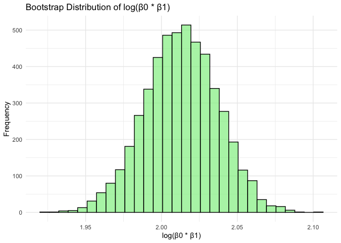

p8105_hw6_akg2197
================
Annie Gorman
2024-12-01

## Loading packages

``` r
library(tidyverse)
```

    ## ── Attaching core tidyverse packages ──────────────────────── tidyverse 2.0.0 ──
    ## ✔ dplyr     1.1.4     ✔ readr     2.1.5
    ## ✔ forcats   1.0.0     ✔ stringr   1.5.1
    ## ✔ ggplot2   3.5.1     ✔ tibble    3.2.1
    ## ✔ lubridate 1.9.3     ✔ tidyr     1.3.1
    ## ✔ purrr     1.0.2     
    ## ── Conflicts ────────────────────────────────────────── tidyverse_conflicts() ──
    ## ✖ dplyr::filter() masks stats::filter()
    ## ✖ dplyr::lag()    masks stats::lag()
    ## ℹ Use the conflicted package (<http://conflicted.r-lib.org/>) to force all conflicts to become errors

``` r
library(p8105.datasets)
library(modelr)
```

# Problem 2

### Loading data

``` r
homicide_df <- read_csv("homicide-data.csv") |>
  mutate(city_state = map2(city, state, ~ paste(.x, .y, sep = ","))) |>  
  filter(!(city_state %in% c("Dallas,TX", "Phoenix,AZ", "Kansas City,MO", "Tulsa,AL"))) |> 
  mutate(
    solved = case_when(
      disposition == "Closed without arrest" ~ 0,
      disposition == "Open/No arrest" ~ 0, 
      disposition == "Closed by arrest" ~ 1,
      TRUE ~ NA_real_  
    )
  ) |> 
  filter(victim_race %in% c("White", "Black")) |>  
  mutate(
    victim_age = as.numeric(victim_age)  
  )
```

    ## Rows: 52179 Columns: 12
    ## ── Column specification ────────────────────────────────────────────────────────
    ## Delimiter: ","
    ## chr (9): uid, victim_last, victim_first, victim_race, victim_age, victim_sex...
    ## dbl (3): reported_date, lat, lon
    ## 
    ## ℹ Use `spec()` to retrieve the full column specification for this data.
    ## ℹ Specify the column types or set `show_col_types = FALSE` to quiet this message.

    ## Warning: There was 1 warning in `mutate()`.
    ## ℹ In argument: `victim_age = as.numeric(victim_age)`.
    ## Caused by warning:
    ## ! NAs introduced by coercion

### Baltimore, MD glm function

Use glm function to fit a logistic regression with resolved vs
unresolved as the outcome and victim age, sex and race as predictors.
Save the output of glm as an R object; apply the broom::tidy to this
object; and obtain the estimate and confidence interval of the adjusted
odds ratio for solving homicides comparing male victims to female
victims keeping all other variables fixed.

``` r
baltimore_df <- homicide_df |>
  filter(city_state == "Baltimore,MD") 

baltimore_reg <- glm(
  solved ~ victim_age + victim_sex + victim_race, 
  data = baltimore_df, 
  family = binomial()
)

baltimore_results <- baltimore_reg |>
  broom::tidy() |>
  mutate(
    OR = exp(estimate),  
    CI_upper = exp(estimate + 1.96 * std.error),  
    CI_lower = exp(estimate - 1.96 * std.error)  
  ) |>
  filter(term == "victim_sexMale") |>
  select(OR, CI_lower, CI_upper)  

baltimore_results
```

    ## # A tibble: 1 × 3
    ##      OR CI_lower CI_upper
    ##   <dbl>    <dbl>    <dbl>
    ## 1 0.426    0.325    0.558

Now run glm for each of the cities in your dataset, and extract the
adjusted odds ratio (and CI) for solving homicides comparing male
victims to female victims. Do this within a “tidy” pipeline, making use
of purrr::map, list columns, and unnest as necessary to create a
dataframe with estimated ORs and CIs for each city.

``` r
allcity_results <- homicide_df |>
  nest(data = -city_state) |>
  mutate(
    model = map(data, ~ glm(solved ~ victim_age + victim_sex + victim_race, data = .x, family = binomial())), 
    tidy_model = map(model, broom::tidy)
  ) |>
  select(-model, -data) |>
  unnest(cols = tidy_model) |>
  mutate(
    OR = exp(estimate), 
    CI_upper = exp(estimate + 1.96 * std.error),  
    CI_lower = exp(estimate - 1.96 * std.error)   
  ) |>
  filter(term == "victim_sexMale") |>
  select(city_state, OR, CI_upper, CI_lower)

allcity_results |>
  knitr::kable(digits = 4)
```

| city_state        |     OR | CI_upper | CI_lower |
|:------------------|-------:|---------:|---------:|
| Albuquerque,NM    | 1.7675 |   3.7609 |   0.8307 |
| Atlanta,GA        | 1.0001 |   1.4631 |   0.6836 |
| Baltimore,MD      | 0.4255 |   0.5579 |   0.3246 |
| Baton Rouge,LA    | 0.3814 |   0.6953 |   0.2093 |
| Birmingham,AL     | 0.8700 |   1.3180 |   0.5743 |
| Boston,MA         | 0.6740 |   1.2760 |   0.3560 |
| Buffalo,NY        | 0.5206 |   0.9352 |   0.2898 |
| Charlotte,NC      | 0.8839 |   1.4027 |   0.5570 |
| Chicago,IL        | 0.4101 |   0.5006 |   0.3360 |
| Cincinnati,OH     | 0.3998 |   0.6771 |   0.2361 |
| Columbus,OH       | 0.5325 |   0.7496 |   0.3783 |
| Denver,CO         | 0.4791 |   0.9707 |   0.2364 |
| Detroit,MI        | 0.5823 |   0.7337 |   0.4622 |
| Durham,NC         | 0.8124 |   1.6833 |   0.3920 |
| Fort Worth,TX     | 0.6690 |   1.1275 |   0.3969 |
| Fresno,CA         | 1.3352 |   3.0709 |   0.5805 |
| Houston,TX        | 0.7110 |   0.9066 |   0.5577 |
| Indianapolis,IN   | 0.9187 |   1.2423 |   0.6794 |
| Jacksonville,FL   | 0.7198 |   0.9657 |   0.5365 |
| Las Vegas,NV      | 0.8373 |   1.1537 |   0.6077 |
| Long Beach,CA     | 0.4102 |   1.0821 |   0.1555 |
| Los Angeles,CA    | 0.6619 |   0.9563 |   0.4581 |
| Louisville,KY     | 0.4906 |   0.7897 |   0.3047 |
| Memphis,TN        | 0.7232 |   0.9884 |   0.5292 |
| Miami,FL          | 0.5152 |   0.8719 |   0.3045 |
| Milwaukee,wI      | 0.7271 |   1.0602 |   0.4987 |
| Minneapolis,MN    | 0.9470 |   1.8749 |   0.4783 |
| Nashville,TN      | 1.0342 |   1.5622 |   0.6847 |
| New Orleans,LA    | 0.5849 |   0.8112 |   0.4218 |
| New York,NY       | 0.2624 |   0.4991 |   0.1379 |
| Oakland,CA        | 0.5631 |   0.8684 |   0.3651 |
| Oklahoma City,OK  | 0.9741 |   1.5203 |   0.6241 |
| Omaha,NE          | 0.3825 |   0.7208 |   0.2030 |
| Philadelphia,PA   | 0.4963 |   0.6522 |   0.3776 |
| Pittsburgh,PA     | 0.4308 |   0.6999 |   0.2651 |
| Richmond,VA       | 1.0061 |   2.0326 |   0.4980 |
| San Antonio,TX    | 0.7046 |   1.2485 |   0.3977 |
| Sacramento,CA     | 0.6688 |   1.3365 |   0.3347 |
| Savannah,GA       | 0.8670 |   1.7801 |   0.4223 |
| San Bernardino,CA | 0.5003 |   1.4622 |   0.1712 |
| San Diego,CA      | 0.4130 |   0.8550 |   0.1995 |
| San Francisco,CA  | 0.6075 |   1.1651 |   0.3168 |
| St. Louis,MO      | 0.7032 |   0.9323 |   0.5304 |
| Stockton,CA       | 1.3517 |   2.9416 |   0.6211 |
| Tampa,FL          | 0.8077 |   1.8760 |   0.3478 |
| Tulsa,OK          | 0.9758 |   1.5517 |   0.6136 |
| Washington,DC     | 0.6902 |   1.0170 |   0.4684 |

Create a plot that shows the estimated ORs and CIs for each city.
Organize cities according to estimated OR, and comment on the plot.

``` r
allcity_results |>
  mutate(city_state = as.character(city_state),  
         city_state = fct_reorder(city_state, OR)) |>  
  ggplot(aes(x = city_state, y = OR)) +
  geom_point() + 
  geom_errorbar(aes(ymin = CI_lower, ymax = CI_upper)) +  
  theme(axis.text.x = element_text(angle = 90, hjust = 1)) +
  labs(x = "City/State", y = "Adjusted OR", title = "Adjusted Odds Ratio for Male vs Female Victims")
```

<!-- -->

# Problem 3

### Loading data

Here, we’ll load the data and convert baby’s sex, presence of
malformations, mother’s race, and father’s race from numeric to factor
variables:

``` r
birthweight_df <- read_csv("birthweight.csv") |>
  janitor::clean_names() |>
  mutate(across(c(babysex, malform, mrace, frace), forcats::as_factor))
```

    ## Rows: 4342 Columns: 20
    ## ── Column specification ────────────────────────────────────────────────────────
    ## Delimiter: ","
    ## dbl (20): babysex, bhead, blength, bwt, delwt, fincome, frace, gaweeks, malf...
    ## 
    ## ℹ Use `spec()` to retrieve the full column specification for this data.
    ## ℹ Specify the column types or set `show_col_types = FALSE` to quiet this message.

Let’s also check for any missing values in the data:

``` r
missing_values = 
  birthweight_df |>
  summarize_all(~sum(is.na(.)))
```
